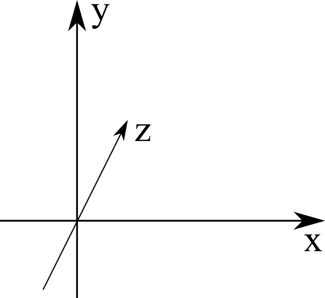

Physic model
============
DXMClib is a naïve Monte Carlo implementation of photon transport. Using this library comes down to creating a world and beam sources. Beam sources can be anything from a monochromatic pencil beam to a collimated x-ray tube beam rotating in a spiral (CT scan). 

This section intends to give an overview of methods and techniques used in the software and a description of the physics model. 

Geometry
--------
DXMClib has a coordinate system that closely follow the DiCOM standard for, among others, CT scanners. A right handed coordinate system with the first axis going from left to right, second down to up and last from shallow to deep. 

The world may be rotated in the basis coordinate system. Orientation of the world is described by two orientation direction cosines: :math:`\vec{x}, \vec{y}`. The third direction cosine is given by :math:`\vec{z} = \vec{x} \times \vec{y}` since the world basis must be orthonormal. A transformation matrix from a point to a rotated world is then :math:`M=\left[ \vec x \: \vec y \: \vec z \right]^{-1}`. This is used when simulating photon transport, while computing histories through the world the particles position and direction is given in the world basis. 

Definition of materials
-----------------------
The only material properties DXMClib cares for are mass attenuation coefficients, atomic form factors, scatter factors and Hartree-Fock orbitals for chemical elements and compounds. Thankfully, Tom Schoonjans have created an excellent library providing these properties. For this reason xraylib_ is a required dependency of DXMClib. Materials can be specified by a chemical element, or a compound described by chemical symbol and number density, for example H2O or HO0.5 for water. In addition, standard NIST materials are also included. 

.. _xraylib: https://github.com/tschoonj/xraylib

Particle transport
------------------
X-ray energies above 150 keV is rarely used in diagnostic imaging, for an electron with energy 150 keV the CSDA range in soft tissue is about 0.3 mm and on par with typical voxel size in CT imaging. DXMClib assumes that all interactions creating secondary electrons positions their energy in the current voxel. All photons are described simply by a position, unit direction vector, energy and weight. Of these only the weight attribute should need an explanation. Ideally all photons will have a weight of unity or one. The weight is introduced to simplify variations in fluence from a source, for example modeling of a CT bow-tie filter. Instead of randomly sampling photons with a fluence profile mimicking a bow-tie filter a flat fluence profile can be used instead and assigning photon weight according to the bow-tie fluence profile. The expectation weight of a large number of photons is 1.0 with the added effect that same number density of photons are simulated on the filter edge as at the center of the filter. 

For efficient photon transport in a voxelized volume there are two suitable algorithms; calculating the radiologic path to compute interaction point [#SUNDERMAN1998]_ or Woodcock tracking [#WOODCOCK1965]_. While Siddons path algorithm by calculating the radiologic path through the whole volume to find an interaction point are suitable to track even a few photons it's quite inefficient compared to Woodcock tracking for large number of voxels. Woodcock tracking are perhaps best explained by introducing photon transport in a homogeneous volume.
To sample a path length of a photon in a homogeneous volume, draw a random number :math:`r` in interval [0, 1). The photon path length is then :math:`l= -\ln(r)/(\mu \rho)` where :math:`\mu` and :math:`\rho` is mass attenuation coefficient and density of the material. This can be extended to a heterogeneous volume by introducing virtual interactions. The path length is calculated in a similar way: :math:`l= -\ln(r)/\zeta` with

.. math::
    \zeta = \max_i \left( \mu_i \rho_i \right)

for each volume element :math:`i`. For the material corresponding to the traversed step :math:`l`, an interaction happens if 

.. math::
    \frac{\mu \rho}{\zeta} \leqslant r

where :math:`r` is a random number in interval [0, 1), otherwise the interaction is virtual (i.e nothing happens) and a new step is calculated. This method is numerical effective but only valid when a large number of photons are simulated, and is unsuitable to showcase one particle track. 

When an interaction occurs type of interaction is sampled by drawing a new random number :math:`r` in interval [0, :math:`\mu`).

.. math::
    \mu = \mu_{photoelectric} + \mu_{compton} + \mu_{rayleight}

if :math:`r < \mu_{photoelectric}` a photoelectric event happens, if :math:`r < \mu_{photoelectric} + \mu_{compton}` an Compton scattering event happens and else a Rayleight scattering event. 

Forced interactions can be used as a variance reduction technique, for example calculating dose in an air chamber inside an CTDI phantom. Since air is thankfully a low density material, relative few interactions occurs compared to in water or plastic. Forcing interactions in a voxel can decrease the variance of a dose calculation in a voxel without spending more CPU cycles to simulate more histories. Forced interactions are implemented such that when a photon steps into a voxel with a forced interaction flag an photoelectric event is scored, even if the interaction is considered virtual. To balance out the scored energy only a fraction 

.. math::
    \frac{\mu_{photoelectric}\rho}{\zeta}

of the photon energy is scored. The weight of the photon is reduced accordingly by 

.. math::
    w_{after} = w_{before} \left(1-\frac{\mu_{photoelectric}\rho}{\zeta} \right)

Further transport of the photon is done by the ordinary method by sampling a random number to determine if an interaction occurs and determine if a Rayleight or Compton event will happen (photoelectric effect is already dealt with).

Generating x-ray spectra
-------------------------
Since most diagnostic x-ray units do not emit monochromatic photon beams this library includes a x-ray spectra generator. The implementation uses a semi-analytical model proposed by Poludniowski [#Poludniowski1]_ [#Poludniowski2]_ for simulating a spectra from a pure tungsten anode. The model is valid for tube potentials from 50kVp to 150 kVp but is accurate up to 300 kVp. The implementation allows for adding filtration of any material and to freely select tube potential and anode angle. Since the model requires an evaluation of a double integral for each energy bin which is quite computational expensive this implementation is multi threaded. The same formalism is also used in the SpekCalc application also by Poludniowski et al. The Heel effect is also modelled for collimated beams along the anode cathode direction, and is equivalent to a corresponding change in anode angle in the model proposed by Poludniowski.  

Sampling photon energies from a specter is implemented by the squaring of histogram method which is quite fast after an initial generation of a lookup table. When an energy bin is sampled the photon energy is finally uniformly sampled within the bin width. 

Photon transport
----------------
Photon transport in DXMClib is implemented in a relatively simple manner. A source will set up one or multiple exposures where an exposure is emitting photons from a fixed point and a fixed beam direction.  A photon is created at the exposure (tube) position and the direction is sampled uniformly inside the collimation. The photon energy is either sampled from a specter or if the source is monochrome, given the selected monochrome energy. The weight of the photon is calculated based on direction and any selected filters, such as a CT bow tie filter or a Heel effect filter or both.

The sampled photon is first checked for intersecting the voxel volume, also called the world. If it intersects, it is transported to the world border before the Woodcock tracking starts. 

Photon electron events for diaognostic x-ray energies handles in dxmclib are photoelectric-, rayleight- and compton-events. In compounds and tissues electrons are normally bound in atoms and will affect interaction events for these energy levels. dxmclib have three ways of dealing with atomic electrons with increased accuracy and computational complexity. The binding energy correction model can be set in the Transport class with the options None, Livermore and Impulse Approximation. The names are usally used for binding energy corrections for compton events. In dxmclib the options are not just for compton events but will also include corrections for photoelectric and rayleight events. For example the impulse approximation model will take into account shell binding effects and doppler broadning for compton events and characteristic radiation from exited shells in photoelectric events. This is done to avoid many and confusing switches for binding effects for each type of events and instead use three options with harmonizing accuracy. 

Photoelectric effect
_____________________

Binding energy option: None
^^^^^^^^^^^^^^^^^^^^^^^^^^^^
This is the simplest of three types of interactions handled by DXMClib. When a photoelectric event is triggered the photon transfers all it's energy to the voxel. The energy from a scattered electron and any photons from bremsstrahlung is assumed not to escape the voxel.

Binding energy option: Livermore
^^^^^^^^^^^^^^^^^^^^^^^^^^^^^^^^
The photoelectric effect for Livermore model is the same as the None option.

Binding energy option: Impulse Approximation
^^^^^^^^^^^^^^^^^^^^^^^^^^^^^^^^^^^^^^^^^^^^^^
Before energy imparted is scored an electron shell in an atom is selected based on the partial photoelectric cross section for each element and shell. However only shells with binding energy grater than 1 keV are considered. For the selected shell characteristic radiation is emitted based on the probability of a radiative transition wich is the photoelectric yield corrected for Coster-Kronig transition probabilities for the corresponding shell. When a radiative transition occurs, energy imparted is scored and the characteristic photon is emitted in a random direction, for other transition all energy are considered to be deposited in the voxel. 

Compton scattering
__________________
Compton events are handled by sampling the Klein Nishina differential cross section for an unbound electron:

.. math::
    \frac{d\rho}{d\epsilon} = \pi r_e^2\frac{m_ec^2}{E_0}Z\left[\frac{1}{\epsilon}+\epsilon \right] \left[ 1-\frac{\epsilon \sin^2\theta}{1+\epsilon^2} \right]

with :math:`r_e` as the classical electron radius, :math:`m_ec^2`: electron mass, :math:`E_0` and :math:`E_1` as energy of incident and scattered photon respectivly, and :math:`\epsilon=E_1/E_0`. Scatter angle :math:`\theta` is given by the Compton formula:

.. math::
    \epsilon = \frac{m_ec^2}{m_ec^2 + E_0(1-\cos\theta)}

The minimum and maximum values for :math:`\epsilon` follows from the compton formula with 

.. math::
    \epsilon_{min} = \frac{m_ec^2}{m_ec^2 +2E_0}

and 

.. math::
    \epsilon_{max} = \frac{m_ec^2}{m_ec^2} = 1

so :math:`\epsilon \in [\epsilon_{min}, 1]`. For low photon energies, i.e typical diagnostic energy levels, it's most efficient to uniformly sample :math:`\epsilon` with the rejection function: 

.. math::
    g = \frac{1}{g_{max}} \left( \frac{1}{\epsilon} + \epsilon -\sin^2\theta \right)

with

.. math::
    g_{max} = \frac{1}{\epsilon_{min}}+\epsilon_{min}

To sample the Klein-Nishina cross section an :math:`\epsilon` is uniformly sampled by 

.. math::
    \epsilon = r_1+(1-r_1)\epsilon_{min}

where :math:`r_1` is a random number in interval :math:`[0, 1]`. For the sampled :math:`\epsilon` calculate :math:`g` and :math:`\theta`. Draw a new random number :math:`r_2` in interval :math:`[0,1]`, if :math:`r_2 \leqslant g` accept the sampled :math:`\epsilon` (and :math:`\theta`) else repeat the process. 

Binding energy option: None
^^^^^^^^^^^^^^^^^^^^^^^^^^^^
All electrons are considered unbound and the compton event is sampled according to the Klein Nishina differential cross section. All energy delivered to the electron are assumed to be deposited in the voxel.  

Binding energy option: Livermore
^^^^^^^^^^^^^^^^^^^^^^^^^^^^^^^^^
Ignoring any binding effects on the electron will overestimate forward scattering for low energy photons. DXMClib can use a simplified model (the Livermore model) for low energy correction. This correction takes into account a scatter function based on Hartree-Fock compton profiles averaged over all electron shell configurations. In this case the sampling is performed by the same procedure as an unbound electron except for a slighly modified rejection function:

.. math::
    g = \frac{1}{g_{max}} \left( \frac{1}{\epsilon} + \epsilon -\sin^2\theta \right) \frac{SF(q)}{Z}

Where :math:`SF(q)` is the scatter factor, :math:`Z` is the atomic number for the material and :math:`q` is the momentum transfer given by:

.. math::
    q = \frac{E_0}{hc} \sin\left( \frac{\theta}{2}\right) 

The scatter function goes from Z at zero mumentum transfer to zero for maximum momentum transfer. In dxmclib the scatter factor for composite materials is obtained by the independent atom approximation, simply put the scatter factor is a weighted average over the atoms in the material. The rejection function is then given by:

.. math::
    g = \frac{1}{g_{max}} \left( \frac{1}{\epsilon} + \epsilon -\sin^2\theta \right) \sum_i w_i \frac{SF_i(q)}{Z_i}

where :math:`w_i` is the number fraction for each element in the material and :math:`\sum w_i=1`.
A lookup table for scatter factors are generated for each material and is interpolated by qubic splines for faster lookup during execution.  

Binding energy option: Impulse Approximation
^^^^^^^^^^^^^^^^^^^^^^^^^^^^^^^^^^^^^^^^^^^^^
A more complex model for compton events are the impulse approximation model and is similar to how the EGSnrc monte carlo code handles compton interactions [#EGSnrc]_. This method approximate bound electrons by assuming the interacting electron have an initial momentum dependent on the current atomic shell. First a random atomic shell is sampled according to the number of electrons in each shell for the current element. The number of shells for each material in dxmclib is limited to 12 for materials consisting of one atomic element and for compounds. In cases where there are more than 12 electron shell configurations, typical in compounds with many elements or heavy elements, the shells with highest binding energies are included. For compounds an electron shell configuration is sampled according to number density of each element and number of electrons in each shell configuration. When the shell have been sampled, scatter angle and scattered photon energy is sampled according to the Klein-Nishina cross section. Note that the sampled shell must have binding energy less or equal to photon energy.

Briefly, the electron is considered unbound but with a momentum :math:`p` corresponing to the binding energy of the electron:

.. math::
    (m_ec^2+U)^2=c^2p^2+m_e^2c^4

where :math:`U` is the binding energy. The momentum transfer from the incoming photon to the electron is:

.. math::
    \vec q = \vec k_1 - \vec k_0 
    
with :math:`\vec k_0` and :math:`\vec k_1` as the incoming and outgoing four momentum vector of the photon. Projection of the momentum transfer onto the initial electron momentum is:

.. math::
    p_z = \frac{\vec p \cdot \vec q}{\| \vec q \|}

The scattered photon energy can be calculated in terms of :math:`p_z`, 

.. math::
    E_1 = \frac{\epsilon E_0}{1-p_z^2 \epsilon^2} \left[  1-p_z^2 \epsilon \cos\theta +p_z \sqrt{1-2 \epsilon \cos \theta + \epsilon^2 (1-p_z^2 \sin^2 \theta)}  \right]

The tricky part of the impulse approximation is sampling of a :math:`p_z` value. In essense, :math:`p_z` is sampled from the Hartree-Fock compton profiles :math:`J(p_z)`,

.. math::
    J(p_z) = \int dp_x dp_y \| \psi(\vec p) \|^2

where :math:`\psi` is the wave function for the bound electron. In dxmclib the Hartree-Fock profiles are approximated by analytical profiles similar to the PENELOPE monte carlo code [#PENELOPE2018]_:

.. math::
    J(p_z) = J(0) (1+2J(0)|p_z|) e^{\frac 1 2 -\frac 1 2 (1+2J(0)|p_z|)^2}

For details concerning the sampling procedure any interested reader is encouraged to take a look on the EGSnrc core manual and the PENELOPE workshop proceedings [#EGSnrc]_ [#PENELOPE2018]_.

Rayleigh scattering
___________________
Binding energy option: None
^^^^^^^^^^^^^^^^^^^^^^^^^^^^^^^^^^^^^^^^^^^^^
Differential cross section for Rayleigh scattering follows Thomson differential cross section for a free electron

.. math::
    \frac{d\rho}{d\Omega} = \frac{r_c^2}{2}\left( 1-\cos^2\theta\right)

Sampling the Thomson cross section is naivly done by randomly draw two numbers: 

.. math::
    p \in \left[0,\frac{4\sqrt 2}{3 \sqrt 3}\right)
    
and  

.. math::
    \theta \in [0, \pi)
    
The scatterangle :math:`\theta` is accepted if:

.. math::
    p < (2-\sin^2 \theta) \sin \theta

The Thomson cross section is valid for bound atomic electrons for energies up to 2 keV.

Binding energy option: Livermore and Impulse Approximation
^^^^^^^^^^^^^^^^^^^^^^^^^^^^^^^^^^^^^^^^^^^^^^^^^^^^^^^^^^^

For higher energies the photon scatter angle is decreased due to the electron configurations of the whole atom. The Rayleight differential cross section is like the Thomson cross section but with the introduction of Hubbels atomic form factor :math:`F(q, Z)` where :math:`Z` is the atomic number and :math:`q` is the momentum transfer given by

.. math::
    q = \frac{E}{hc} \sin\left( \frac{\theta}{2}\right) 

for photon energy :math:`E` and :math:`hc` as Planck's constant and speed of light in vacuum [#Hubbell]_. 

The differential cross section for Rayleigh scattering is then

.. math::
    \frac{d\rho}{d\Omega} = \frac{r_c^2}{2}\left( 1-\cos^2\theta\right) \left[F(q, Z)\right]^2

For sampling of scatter angle DXMClib uses a similar approach as the EGSnrc [#EGSnrc]_ monte carlo code. By defining 

.. math::
    A(q_{max}^2) = \int_0^{q_{max}^2} \left[F(q, Z)\right]^2 dq^2

with 

.. math::
    q_{max} = \frac{E}{hc}

and

.. math::
    \frac{[F(q,Z)]^2}{A(q_{max}^2)}
    
to be used as a probability density function with

.. math::
   g= \frac{1-\cos^2\theta}{2}
    
as a rejection function. To sample a scatter angle :math:`q` is first sampled by 

.. math::
    A(q^2) = r_1 A(q_{max}^2)
    
with :math:`r_1` as a random uniform number in interval [0,1). In dxmclib :math:`q` is found by lookup tables of the integral :math:`A(q^2)`. The sampled momentum transfer and therefore scatter angle :math:`\theta` is accepted if 

.. math::
    \frac{1+\cos^2 \theta}{2} > r_2

where :math:`r_2` is a random number in interval [0, 1). 

Radiation sources
--------------------------
DXMClib models a few radiation sources that should cover most setups in clinical x-ray imaging:

- DX: A x-ray tube source with rectangular collimation.
- CT seq: A CT source for sequental og step and shoot imaging.
- CT spiral: A CT source for spiral aqusitions.
- CT dual: A CT source for dual energy aqusitions.
- Pencil beam: A monochromatic pencil beam.
- Isotropic beam: A rectangular collimated beam, either monochromatic or a user supplied specter.

All of the radiation sources can be positioned arbitrary with the use of source direction cosines and a position vector, although most sources also implements som helper functions to make life easier. Source direction cosines are three orthonormal vectors with the first (:math:`\vec x`) perpendicular to the second vector (:math:`\vec y`) along the anode cathode direction. The third vector :math:`\vec z = \vec x \times \vec y` is along the beam direction. All vectors have basis in the world coordinate system. 

All sources in DXMClib uses the concept of an *exposure* meaning a static position and direction where a number of photon histories are emitted. This makes hardly any sense for conventional x-ray examinations, but for CT examinations an exposure is a position around the patient where a number of photons is emitted.  

.. NOTE::
    Each exposure can run in parallell for computers with multiple cores (all computers nowadays). For optimal performance use atleast twice as many exposures as cores available. Note that number of exposures for CT sources can only be controlled indirectly by setting step angle between each exposure. 

Number of histories per exposure can be set for every source. The optimal number of histories is dependent on the requirered resolution and certainties for a specific application. For example, calculating dose in a large volume of plastics requires much fewer histories compared to a detailed dose map of a CT examination. Voxel size also matters since reaching many events in a small voxel needs more histories. As a guideline, a detailed dose calculation on the voxel level for a thorax examination, either CT or DX, the total number of histories should be about :math:`10^{7}-10^{9}`.   

References
----------
.. [#SUNDERMAN1998] Sunderman E. et al. A Fast Algorithm to Calculate the Exact Radiological Path Through a Pixel Or Voxel Space. Journal of Computing and Information Technology 6(1). December 1998.
.. [#WOODCOCK1965] Woodcock E.R. et al. Techniques used in the GEM code for Monte Carlo neutronics calculations in reactors and other systems of complex geometry. ANL-7050. Argonne National Laboratory, 1965.
.. [#Poludniowski1] Poludniowski G.G. and Evans, P.M. Calculation of x‐ray spectra emerging from an x‐ray tube. Part I. Electron penetration characteristics in x‐ray targets. Med. Phys., 34: 2164-2174 (2007). doi:10.1118/1.2734725
.. [#Poludniowski2] Poludniowski G.G. Calculation of x‐ray spectra emerging from an x‐ray tube. Part II. X‐ray production and filtration in x‐ray targets. Med. Phys., 34: 2175-2186 (2007). doi:10.1118/1.2734726
.. [#Hubbell] Hubbell J.H. et al Atomic form factors, incoherent scattering functions, and photon scattering cross sections, J. Phys. Chem. Ref. Data, Vol.4, No. 3, 1975
.. [#EGSnrc] I Kawrakow, E Mainegra-Hing, DWO Rogers, F Tessier, BRB Walters. The EGSnrc Code System: Monte Carlo simulation of electron and photon transport. Technical Report PIRS-701, National Research Council Canada (2020).
.. [#PENELOPE2018]  PENELOPE 2018: A code system for Monte Carlo simulation of electron and photon transport: Workshop Proceedings, Barcelona, Spain, 28 January – 1 February 2019, OECD Publishing, Paris, https://doi.org/10.1787/32da5043-en.
